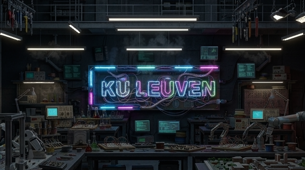

# KU Leuven Punk Plymouth Theme

This repository generates an animated Plymouth boot theme from KU Leuven punk artwork.



It includes:
- A frame generator with TL flicker, neon border pulse, and neon logo flicker.
- A converter that turns rendered frames into a Plymouth script theme.
- A Nix flake output that can be imported into other Nix repositories.

## Requirements

- `python3`
- Python package `Pillow`
- `ffmpeg` (for MP4 and sequence preview)
- `make`

If you use Nix, enter the dev shell:

```bash
nix develop
```

## Make Targets

- `make generate` - render PNG frames into `frames/`
- `make mp4` - encode `frames/` into `tl-flicker.mp4`
- `make preview` - build MP4 and preview it with `ffplay`
- `make preview-sequence` - preview raw PNG sequence directly
- `make plymouth-theme` - generate Plymouth theme directory
- `make clean` - remove generated files

## Typical Workflow

```bash
make generate
make preview-sequence
make mp4
make plymouth-theme
```

Generated theme output goes to:

- `plymouth-theme-kuleuven-punk/`

Key generated files:

- `plymouth-theme-kuleuven-punk/kuleuven-punk.script`
- `plymouth-theme-kuleuven-punk/kuleuven-punk.plymouth`

## Tuning Animation

Most settings are exposed as Make variables. Example:

```bash
make generate FPS=12 COUNT=360 NEON_PERIOD=24 NEON_MIN_SCALE=0.4 NEON_MAX_SCALE=1.8
```

Useful knobs:
- `CHANGE_PROBABILITY`, `MAX_FLICKER_FRAMES` for TL behavior
- `NEON_PERIOD`, `NEON_MIN_SCALE`, `NEON_MAX_SCALE` for border pulse
- `LOGO_FLICKER_PROBABILITY`, `LOGO_MIN_FLICKER_FRAMES`, `LOGO_MAX_FLICKER_FRAMES`, `LOGO_FLICKER_ON_PROBABILITY` for logo flicker

## Flake Outputs

This flake exports:
- `packages.<system>.kuleuven-punk-plymouth` (also `default`)
- `packages.<system>.kuleuven-punk` (alias)
- `overlays.default`
- `nixosModules.default`
- `devShells.default`

The package installs a complete Plymouth theme at:

- `$out/share/plymouth/themes/kuleuven-punk/`

### Use in another flake

```nix
{
  inputs.kul-boot.url = "github:<user>/<repo>";

  outputs = { self, nixpkgs, kul-boot, ... }: {
    nixosConfigurations.host = nixpkgs.lib.nixosSystem {
      system = "x86_64-linux";
      modules = [
        kul-boot.nixosModules.default
        {
          services.kulBoot.plymouth.enable = true;
        }
      ];
    };
  };
}
```

### Package-only usage (no module)

```nix
{
  boot.plymouth.enable = true;
  boot.plymouth.themePackages = [ inputs.kul-boot.packages.${pkgs.system}.default ];
  boot.plymouth.theme = "kuleuven-punk";
}
```

Equivalent explicit package attribute:

```nix
inputs.kul-boot.packages.${pkgs.system}.kuleuven-punk-plymouth
```

### Module usage

```nix
{
  imports = [ inputs.kul-boot.nixosModules.default ];
  services.kulBoot.plymouth.enable = true;
}
```
